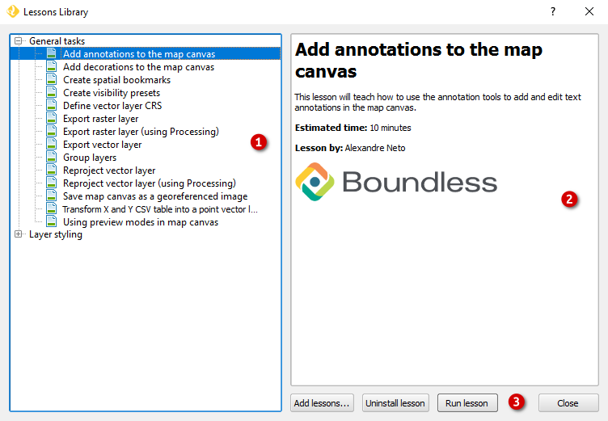
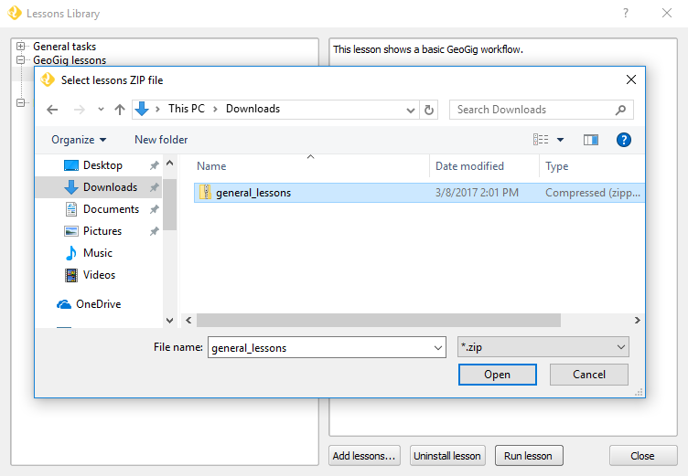
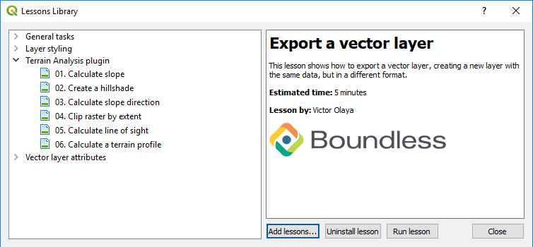
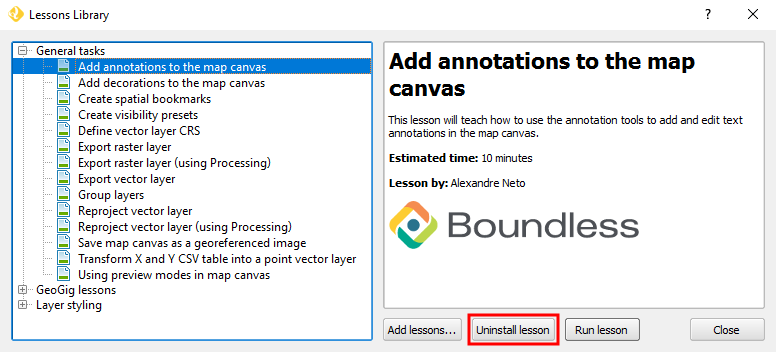
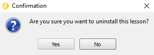
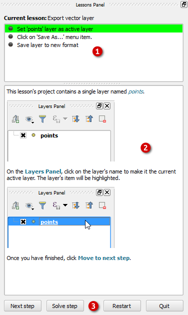
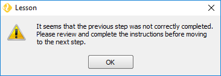
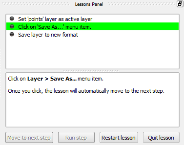
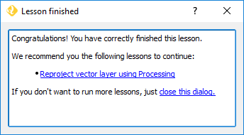

.. _lessons_usage:

Usage
=====

The Lessons Library
-------------------

To open the :guilabel:`Lessons Library`, go to :menuselection:`Plugins -->
Lessons --> Open Lessons Library...`.

The left-hand panel (1) lists all available lessons organized by thematic
groups. If necessary, click the cross icon next to the group's name to show
the lessons inside.

Upon selecting a lesson (by clicking its name in the list) the right-hand
panel (2) shows a small description of the lesson's content, estimated
time of completion, and author.

In the dialog's bottom-right corner there is a set of buttons (3):

* **Add lessons...** - To install lessons from ZIP package;
* **Uninstall lesson/group** - Deletes the selected lesson or group of lessons;
* **Run lesson** - Starts the selected lesson;
* **Close** - Closes the :guilabel:`Lessons Library` dialog.

Install new lessons
-------------------

There are two ways of adding new lessons to the :guilabel:`Lesson Library`:

* From a zip package;
* Through other plugins.

From ZIP package
................

In the :guilabel:`Lessons Library` (:menuselection:`Plugins -->
Lessons --> Open Lessons Library`), click the :guilabel:`Add lessons...`
button. Browse to and select the ZIP package and click :guilabel:`Open`.
After it, the lessons in the ZIP package will become available in the
:guilabel:`Lessons Library`.

   Install lessons from a zip package

Through other plugins
.....................

Some plugins can automatically install new lessons. For example, upon
installation of Boundless `Terrain Analysis plugin <https://connect.boundlessgeo.com/docs/desktop/plugins/terrainanalysis/>`_,
a new group of lessons will become available in lessons library.

   Terrain analysis plugin lessons

Uninstall lessons
-----------------

To uninstall a lesson, open the :guilabel:`Lessons
Library` (:menuselection:`Plugins --> Lessons --> Open Lessons Library`),
select a lesson from the list and click :guilabel:`Uninstall lesson`.

A message requests you to confirm the uninstall action. Click :guilabel:`Yes`.

You can also uninstall a group of lessons by selecting the group's name in
the lessons list panel and click :guilabel:`Uninstall lessons group`.

.. warning::

   Upon uninstall, the lesson or lessons group will be completely removed from
   your disk. Make sure you have a way to reinstall them if you need to.

Lessons Panel
-------------

By default, when a lesson starts, the :guilabel:`Lessons Panel` will be on the
right side of the QGIS's window. The :guilabel:`Lessons Panel` includes a
Lesson's steps index (1) to track the lesson's progress, a description
window (2) to show the current step's instructions, and a button bar (3).

The following buttons compose the button bar:

* **Next step** - To go to the next lesson's step.
* **Solve step** - Helps to perform the steps instructions (not always
  available).
* **Restart** - Resets the project and cleans all the lesson's progress made
  so far.
* **Quit** - Cleans the lesson's progress and closes the :guilabel:`Lessons
  Panel`, but keeps the project loaded.

Following a lesson
------------------

At the start, the lessons open a prepared project with all the necessary data.
Unless the lesson is about loading data, you should never need to add data
yourself.

For each of the lesson's steps, follow the instructions in the description
window. When you have finished executing those instructions, click
:guilabel:`Next step`.

Some steps will not let you move to the next one until you finished the
current step's instructions correctly. In those cases a message pops up,
asking you to review and execute the instructions.

Some steps will move to the next step automatically as soon as you complete the
instructions. The step’s description will inform you of that. Typically, this
is used in steps that ask you to click a menu item, or will open a
blocking dialog.

In some lessons' steps, if you get stuck while following the instructions,
you can click :guilabel:`Solve step`. This functionality will help you perform
the step's instructions, either by executing it for you or by showing how to
do it.

When you have finished all steps of a lesson, a dialog shows up congratulating
you for the achievement. In that same dialog, you can either start one of the
suggested lessons or close the dialog and the :guilabel:`Lessons panel`.

